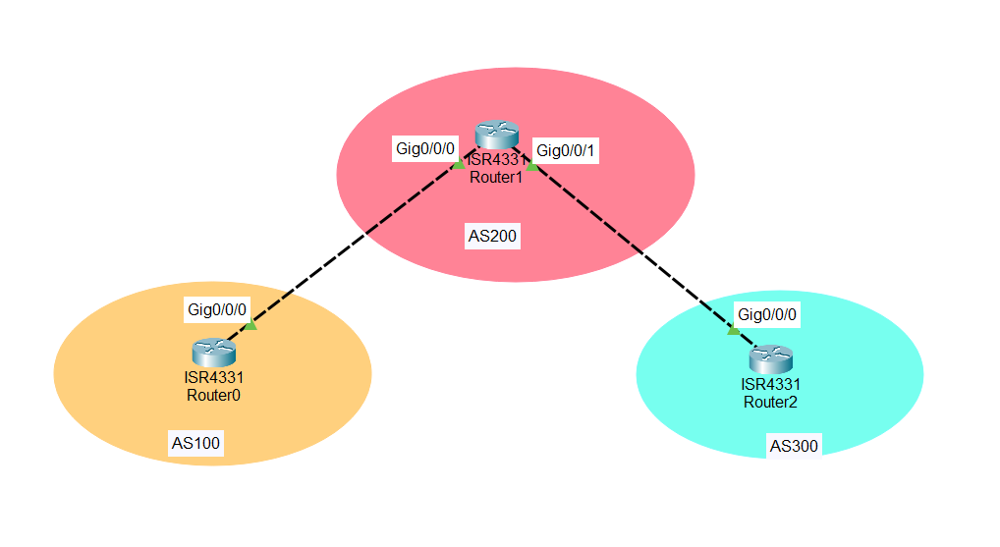

# 目录结构
- [目录结构](#目录结构)
- [实验内容](#实验内容)
- [步骤1 配置3个路由器的ip地址](#步骤1-配置3个路由器的ip地址)
- [步骤2 在路由器中配置BGP协议](#步骤2-在路由器中配置bgp协议)
- [步骤三 配置路由信息通告](#步骤三-配置路由信息通告)
- [步骤四  测试联通性](#步骤四--测试联通性)

# 实验内容

使得自治区AS100, AS200和AS300网络互通
实验工具使用cisco packet tracer


# 步骤1 配置3个路由器的ip地址
首先打开router1的console
首先配置g0/0/0 接口
```
Router>en
Router#conf t 
Enter configuration commands, one per line.  End with CNTL/Z.
Router(config)#int g
Router(config)#int g0/0/0
Router(config-if)#ip add 10.0.0.2 255.0.0.0
Router(config-if)#
Router(config-if)#no shut
```
接着配置g0/0/1 接口
```
Router>en
Router#conf t 
Enter configuration commands, one per line.  End with CNTL/Z.
Router(config)#int g
Router(config)#int g0/0/1
Router(config-if)#ip add 20.0.0.2 255.0.0.0
Router(config-if)#
Router(config-if)#no shut
```

接着打开router0的console
配置g0/0/0 接口
```
Router>en
Router#conf t 
Enter configuration commands, one per line.  End with CNTL/Z.
Router(config)#int g
Router(config)#int g0/0/0
Router(config-if)#ip add 10.0.0.1 255.0.0.0
Router(config-if)#
Router(config-if)#no shut
```

接着打开router2的console
配置g0/0/0 接口
```
Router>en
Router#conf t 
Enter configuration commands, one per line.  End with CNTL/Z.
Router(config)#int g
Router(config)#int g0/0/0
Router(config-if)#ip add 20.0.0.1 255.0.0.0
Router(config-if)#
Router(config-if)#no shut
```

# 步骤2 在路由器中配置BGP协议
首先在router1中
```
Router(config-router)#router bgp 200
Router(config-router)#neighbor 10.0.0.1 remote-as 100
Router(config-router)#neighbor 20.0.0.1 remote-as 300
```

接着在router0中
```
Router(config-router)#router bgp 100
Router(config-router)#neighbor 10.0.0.2 remote-as 200
```

最后在router2中
```
Router(config-router)#router bgp 300
Router(config-router)#neighbor 20.0.0.2 remote-as 200
```

# 步骤三 配置路由信息通告
在router0 中配置
```
Router(config)#router bgp 100
Router(config-router)#network 10.0.0.0 mask 255.0.0.0  
```

在router2 中配置
```
Router(config)#router bgp 300
Router(config-router)#network 20.0.0.0 mask 255.0.0.0
```


# 步骤四  测试联通性
在AS100的router0 中ping AS300的router2中
```
Router#ping 20.0.0.1

Type escape sequence to abort.
Sending 5, 100-byte ICMP Echos to 20.0.0.1, timeout is 2 seconds:
!!!!!
Success rate is 100 percent (5/5), round-trip min/avg/max = 0/0/0 ms
```

